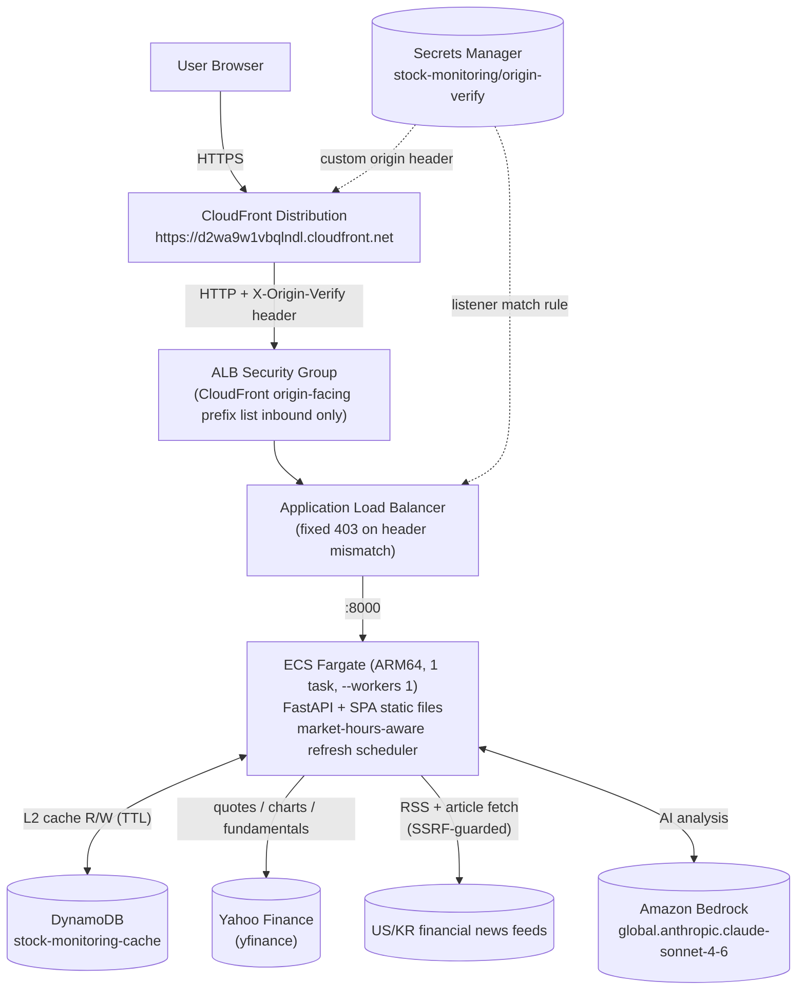
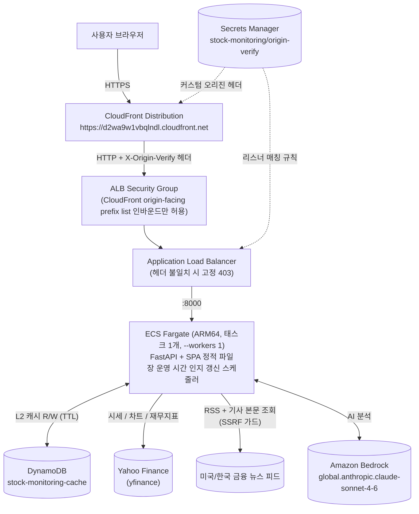

# stock-monitoring

[](LICENSE)
[]()
[]()
[]()
<a href="#english"></a>
<a href="#korean"></a>

Real-time stock monitoring dashboard on Yahoo Finance data — quotes, charts, fundamentals, news, and AI analysis | Yahoo Finance 기반 실시간 주식 모니터링 대시보드 — 시세·차트·재무지표·뉴스·AI 분석

---

<a id="english"></a>

# English

## Overview

stock-monitoring is a real-time stock monitoring web service built on Yahoo Finance data. It tracks US and Korean market indices, 100 major stocks, economic indicators, and financial news, and provides AI-powered stock and news-article analysis through Amazon Bedrock. The service runs on AWS as a single CDK stack (CloudFront → ALB → ECS Fargate + DynamoDB) with a tiered cache that keeps upstream API calls to a minimum.

## Features

- **Real-time market dashboard** — US (S&P 500, NASDAQ, DOW) and KR (KOSPI, KOSDAQ) indices, 100 tracked stocks, and economic indicators refreshed on a market-hours-aware schedule
- **Interactive price charts** — Candlestick and line charts with 1w/1m/3m/1y ranges rendered with lightweight-charts
- **Fundamentals and news** — Per-stock financial metrics plus aggregated US/KR financial news from RSS feeds, with SSRF-guarded article body extraction
- **AI analysis with Amazon Bedrock** — Stock summaries and news-article analysis using Claude (`global.anthropic.claude-sonnet-4-6`), rate-limited per client IP
- **Tiered caching** — In-memory L1 + DynamoDB L2 with TTL and single-flight key locking, and a 60-second quote overlay that keeps prices fresh on cached detail responses

## Architecture



- **Production**: https://d2wa9w1vbqlndl.cloudfront.net — a single CloudFront distribution serves both the SPA and `/api/*` (default behavior `CACHING_DISABLED`; `/assets/*` long-cached thanks to immutable Vite hashes).
- The ALB accepts inbound traffic only from the CloudFront origin-facing managed prefix list; as a second layer of defense, the listener forwards only when the `X-Origin-Verify` header matches — direct ALB access gets a fixed 403.
- A single Fargate task with `--workers 1` is deliberate: the in-memory L1 cache and the AI global semaphore are per-process, so scaling out requires a design review first.
- The scheduler pre-refreshes hot cache keys on a market-hours-aware cadence, and DynamoDB (TTL) acts as the L2 cache that survives task restarts.
- The stack reuses the existing `cc-on-bedrock-vpc` by lookup only — it never creates network resources.

## Prerequisites

- Python 3.12+
- Node.js 20+ (npm)
- AWS credentials and AWS CDK v2 (deployment only)
- Docker (container image build and deployment only)

## Installation

```bash
# Clone the repository
git clone https://github.com/whchoi98/stock-monitoring.git
cd stock-monitoring

# Backend dependencies
cd backend
python3.12 -m venv .venv
.venv/bin/pip install -r requirements.txt -r requirements-dev.txt
cd ..

# Frontend dependencies
cd frontend
npm install
cd ..

# Infra dependencies (deployment only)
cd infra
python3.12 -m venv .venv
.venv/bin/pip install -r requirements.txt
cd ..
```

## Usage

```bash
# Build the frontend and run the integrated app
# Serves the API and static frontend at http://localhost:8000
make run

# Frontend dev server with hot reload (proxies API to :8000)
cd frontend && npm run dev

# Deploy to AWS (CloudFront + ALB + ECS Fargate + DynamoDB, ~4 minutes)
cd infra && .venv/bin/cdk deploy --require-approval never

# Post-deploy smoke test (CloudFront paths + direct-ALB block check)
bash scripts/smoke.sh https://d2wa9w1vbqlndl.cloudfront.net stock-monitoring-alb-1937169801.ap-northeast-2.elb.amazonaws.com
```

## Configuration

Environment variables read by the backend (`backend/app/core/config.py`). In production the CDK stack injects `CACHE_TABLE` and `BEDROCK_REGION`; local runs use the defaults.

| Variable | Description | Default |
|----------|-------------|---------|
| `CACHE_TABLE` | DynamoDB table name for the L2 cache | `stock-monitoring-cache` |
| `BEDROCK_MODEL_ID` | Bedrock cross-region inference profile for AI analysis (`ap-northeast-2` only offers the `global.`-prefixed Sonnet profile) | `global.anthropic.claude-sonnet-4-6` |
| `BEDROCK_REGION` | AWS region for Bedrock API calls | `ap-northeast-2` |

## Project Structure

```text
stock-monitoring/
  backend/               # Python 3.12 FastAPI server
    app/
      api/               # Route handlers (stocks, market, ai, health) + rate limiting
      services/          # Yahoo Finance data, charts, fundamentals, news, Bedrock AI
      cache/             # Tiered cache (in-memory L1 + DynamoDB L2)
      core/              # Config, scheduler, market hours
    tests/               # pytest suite
  frontend/              # React 19 + TypeScript + Vite 8
    src/
      api/               # API client, react-query hooks, types
      components/        # common / market / stock components
      pages/             # Dashboard, StockDetail, ArticleAnalysis
  infra/                 # AWS CDK v2 (Python), single stack
    stacks/              # CloudFront -> ALB -> ECS Fargate + DynamoDB
  scripts/               # smoke.sh post-deploy check
  docs/                  # Specs, ADRs, runbooks, reference docs
  Dockerfile             # Multi-stage build (frontend build -> Python runtime)
  Makefile               # build / run / test targets
```

## Testing

```bash
# Run all tests (backend + frontend)
make test

# Backend only (pytest)
cd backend && .venv/bin/pytest -q

# Frontend only (vitest)
cd frontend && npx vitest run
```

## API Documentation

The backend exposes a REST API under `/api` covering market snapshots, stock quotes, charts, fundamentals, news, and AI analysis, plus a health endpoint. See [docs/api-reference.md](docs/api-reference.md) for the full endpoint reference.

## Contributing

1. Fork the repository
2. Create your branch (`git checkout -b feat/amazing-feature`)
3. Commit changes (`git commit -m 'feat: add amazing feature'`)
4. Push to the branch (`git push origin feat/amazing-feature`)
5. Open a Pull Request

Commit messages follow [Conventional Commits](https://www.conventionalcommits.org/) with an English subject line:

```text
feat: add sector filter to dashboard
fix: handle empty chart response for delisted symbols
docs: update API reference
```

## License

This project is licensed under the MIT License — see the [LICENSE](LICENSE) file for details.

## Contact

- Maintainer: WooHyung Choi — [github.com/whchoi98](https://github.com/whchoi98)
- Email: whchoi98@gmail.com
- Issues: [github.com/whchoi98/stock-monitoring/issues](https://github.com/whchoi98/stock-monitoring/issues)

---

<a id="korean"></a>

# 한국어

## 개요

stock-monitoring은 Yahoo Finance 데이터를 기반으로 한 실시간 주식 모니터링 웹 서비스입니다. 미국·한국 시장 지수, 주요 100개 종목, 경제 지표, 금융 뉴스를 추적하며 Amazon Bedrock 기반의 종목·뉴스 기사 AI 분석을 제공합니다. AWS 위에서 단일 CDK 스택(CloudFront → ALB → ECS Fargate + DynamoDB)으로 운영되며, 계층형 캐시로 업스트림 API 호출을 최소화합니다.

## 주요 기능

- **실시간 시장 대시보드** — 미국(S&P 500, NASDAQ, DOW)·한국(KOSPI, KOSDAQ) 지수, 추적 종목 100개, 경제 지표를 장 운영 시간 인지 스케줄로 갱신
- **인터랙티브 가격 차트** — lightweight-charts 기반 1주/1개월/3개월/1년 구간 캔들스틱·라인 차트 제공
- **재무지표·뉴스** — 종목별 재무 지표와 미국/한국 RSS 피드 기반 금융 뉴스 집계, SSRF 가드가 적용된 기사 본문 추출
- **Amazon Bedrock AI 분석** — Claude(`global.anthropic.claude-sonnet-4-6`)를 이용한 종목 요약·뉴스 기사 분석, 클라이언트 IP당 레이트리밋 적용
- **계층형 캐시** — 인메모리 L1 + DynamoDB L2(TTL)와 single-flight 키 락, 캐시된 상세 응답의 가격을 60초 시세로 덮어쓰는 가격 오버레이 적용

## 아키텍처



- **프로덕션**: https://d2wa9w1vbqlndl.cloudfront.net — 단일 CloudFront 배포가 SPA와 `/api/*`를 함께 서빙합니다 (기본 동작 `CACHING_DISABLED`, `/assets/*`는 Vite 불변 해시 덕분에 장기 캐시).
- ALB는 CloudFront origin-facing 관리형 prefix list의 인바운드만 허용하며, 2차 방어로 리스너가 `X-Origin-Verify` 헤더 일치 시에만 forward합니다 — ALB 직접 접근은 고정 403.
- Fargate 태스크 1개 + `--workers 1`은 의도된 값입니다: 인메모리 L1 캐시와 AI 전역 세마포어가 프로세스 단위이므로 스케일아웃 전 설계 재검토가 필요합니다.
- 스케줄러가 장 운영 시간을 인지하는 주기로 핫 캐시 키를 선제 갱신하며, DynamoDB(TTL)가 태스크 재시작에도 유지되는 L2 캐시 역할을 합니다.
- 스택은 기존 `cc-on-bedrock-vpc`를 lookup으로만 재사용하며 네트워크 리소스를 절대 생성하지 않습니다.

## 사전 요구 사항

- Python 3.12+
- Node.js 20+ (npm)
- AWS 자격 증명 및 AWS CDK v2 (배포 시에만 필요)
- Docker (컨테이너 이미지 빌드·배포 시에만 필요)

## 설치 방법

```bash
# Clone the repository
git clone https://github.com/whchoi98/stock-monitoring.git
cd stock-monitoring

# Backend dependencies
cd backend
python3.12 -m venv .venv
.venv/bin/pip install -r requirements.txt -r requirements-dev.txt
cd ..

# Frontend dependencies
cd frontend
npm install
cd ..

# Infra dependencies (deployment only)
cd infra
python3.12 -m venv .venv
.venv/bin/pip install -r requirements.txt
cd ..
```

## 사용법

```bash
# Build the frontend and run the integrated app
# Serves the API and static frontend at http://localhost:8000
make run

# Frontend dev server with hot reload (proxies API to :8000)
cd frontend && npm run dev

# Deploy to AWS (CloudFront + ALB + ECS Fargate + DynamoDB, ~4 minutes)
cd infra && .venv/bin/cdk deploy --require-approval never

# Post-deploy smoke test (CloudFront paths + direct-ALB block check)
bash scripts/smoke.sh https://d2wa9w1vbqlndl.cloudfront.net stock-monitoring-alb-1937169801.ap-northeast-2.elb.amazonaws.com
```

## 환경 설정

백엔드가 읽는 환경변수입니다(`backend/app/core/config.py`). 프로덕션에서는 CDK 스택이 `CACHE_TABLE`과 `BEDROCK_REGION`을 주입하며, 로컬 실행 시에는 기본값을 사용합니다.

| Variable | Description | Default |
|----------|-------------|---------|
| `CACHE_TABLE` | L2 캐시용 DynamoDB 테이블 이름 | `stock-monitoring-cache` |
| `BEDROCK_MODEL_ID` | AI 분석에 사용하는 Bedrock 크로스리전 추론 프로필 (`ap-northeast-2`에는 `global.` 프리픽스 Sonnet 프로필만 존재) | `global.anthropic.claude-sonnet-4-6` |
| `BEDROCK_REGION` | Bedrock API 호출 리전 | `ap-northeast-2` |

## 프로젝트 구조

```text
stock-monitoring/
  backend/               # Python 3.12 FastAPI 서버
    app/
      api/               # 라우트 핸들러 (stocks, market, ai, health) + 레이트리밋
      services/          # Yahoo Finance 데이터, 차트, 재무지표, 뉴스, Bedrock AI
      cache/             # 계층형 캐시 (인메모리 L1 + DynamoDB L2)
      core/              # 설정, 스케줄러, 장 운영 시간
    tests/               # pytest 테스트
  frontend/              # React 19 + TypeScript + Vite 8
    src/
      api/               # API 클라이언트, react-query 훅, 타입
      components/        # common / market / stock 컴포넌트
      pages/             # Dashboard, StockDetail, ArticleAnalysis
  infra/                 # AWS CDK v2 (Python), 단일 스택
    stacks/              # CloudFront -> ALB -> ECS Fargate + DynamoDB
  scripts/               # smoke.sh 배포 후 점검
  docs/                  # 스펙, ADR, 런북, 레퍼런스 문서
  Dockerfile             # 멀티스테이지 빌드 (프론트엔드 빌드 -> Python 런타임)
  Makefile               # build / run / test 타깃
```

## 테스트

```bash
# Run all tests (backend + frontend)
make test

# Backend only (pytest)
cd backend && .venv/bin/pytest -q

# Frontend only (vitest)
cd frontend && npx vitest run
```

## API 문서

백엔드는 `/api` 하위에 시장 스냅샷, 종목 시세, 차트, 재무지표, 뉴스, AI 분석을 다루는 REST API와 헬스 엔드포인트를 제공합니다. 전체 엔드포인트 레퍼런스는 [docs/api-reference.md](docs/api-reference.md)를 참조합니다.

## 기여 방법

1. Fork the repository
2. Create your branch (`git checkout -b feat/amazing-feature`)
3. Commit changes (`git commit -m 'feat: add amazing feature'`)
4. Push to the branch (`git push origin feat/amazing-feature`)
5. Open a Pull Request

커밋 메시지는 [Conventional Commits](https://www.conventionalcommits.org/)를 따르며 제목은 영어로 작성합니다:

```text
feat: add sector filter to dashboard
fix: handle empty chart response for delisted symbols
docs: update API reference
```

## 라이선스

이 프로젝트는 MIT License로 배포됩니다. 자세한 내용은 [LICENSE](LICENSE) 파일을 참조합니다.

## 연락처

- Maintainer: WooHyung Choi — [github.com/whchoi98](https://github.com/whchoi98)
- Email: whchoi98@gmail.com
- Issues: [github.com/whchoi98/stock-monitoring/issues](https://github.com/whchoi98/stock-monitoring/issues)
