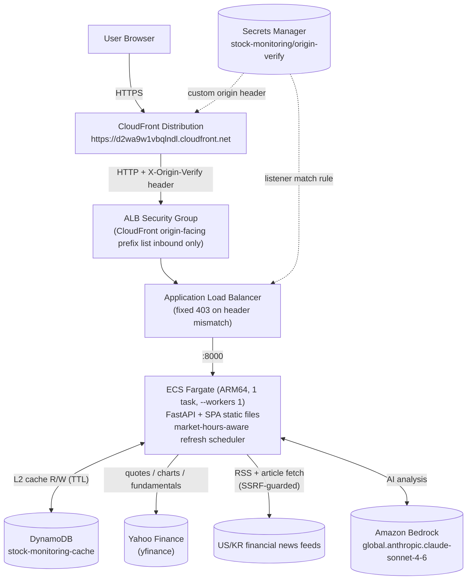
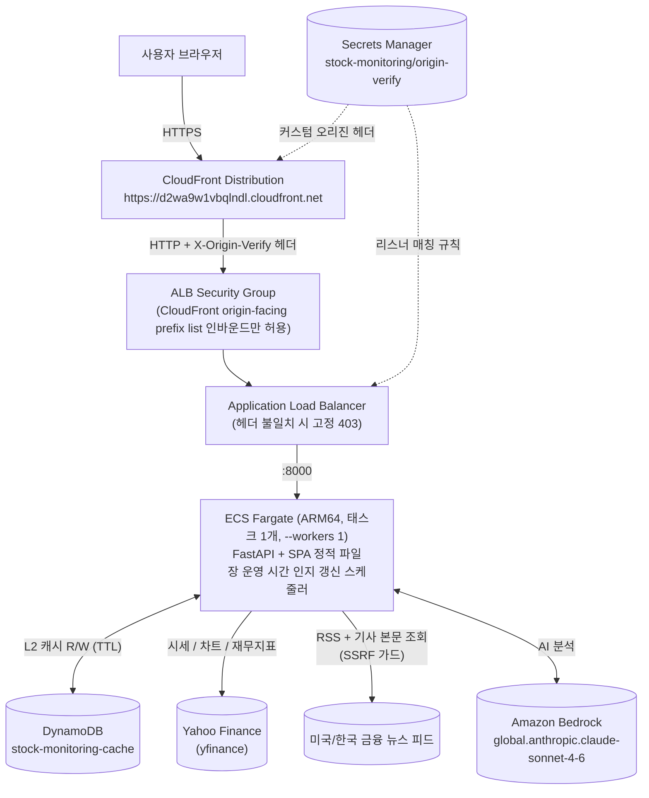

# stock-monitoring

[](LICENSE)
[]()
[]()
[]()
<a href="#english"></a>
<a href="#korean"></a>

Real-time stock monitoring dashboard on Yahoo Finance data — quotes, charts, fundamentals, news, and AI analysis | Yahoo Finance 기반 실시간 주식 모니터링 대시보드 — 시세·차트·재무지표·뉴스·AI 분석

---

<a id="english"></a>

# English

## Overview

stock-monitoring is a real-time stock monitoring web service built on Yahoo Finance data. It tracks US and Korean market indices, 100 major stocks, economic indicators, and financial news, and provides AI-powered stock and news-article analysis through Amazon Bedrock. The service runs on AWS as a single CDK stack (CloudFront → ALB → ECS Fargate + DynamoDB) with a tiered cache that keeps upstream API calls to a minimum.

## Features

- **Real-time market workspace** — US (S&P 500, NASDAQ, DOW) and KR (KOSPI, KOSDAQ) indices, 100 tracked stocks (US 50 + KR 50) and 11 economic indicators (oil, metals, FX, US 10Y, BTC/ETH) refreshed on a market-hours-aware schedule (45 s quotes / 120 s news); a sticky market strip with an indicator crawl, a MACRO panel, sector heat bars and a quote monitor with US / KR / ★watch scope tabs
- **Interactive price charts** — Candlestick charts over 1W / 1M / 3M / 6M / 1Y / 5Y (1W in hourly bars, 5Y in weekly bars) rendered with lightweight-charts: MA5/MA20, Bollinger Bands, volume, golden/dead-cross markers, LVL reference lines (previous close, 52-week high/low), RSI(14) and MACD(12,26,9) sub-panes sharing one crosshair, and a candle ⇄ OHLC data-table view
- **Fundamentals and news** — Per-stock financial metrics plus a US/KR RSS news wire with language tabs (all / 한국어 / English) and a title-keyword filter; article bodies are fetched behind SSRF guards, a 20 s total fetch deadline and a 2 MB decompressed-size cap with decompression-bomb bounds
- **AI analysis with Amazon Bedrock** — Stock and news-article analysis with Claude (`global.anthropic.claude-sonnet-4-6`) streamed over SSE (`phase` → `delta`* → `final`); the stock panel accepts a free-form question (1–200 chars, with presets) that is normalised and fenced inside the prompt and cached per question; guarded by a per-IP rate limit, a 6-hour result cache and a global concurrency cap
- **Korean-name symbol search** — A ⌘K / Ctrl+K / `/` command bar ranks the 100-symbol universe by symbol, Latin name and Korean name (`name_ko`), matching Hangul syllables, initials (초성: "ㅅㅅㅈㅈ" → 삼성전자) and the mixed forms an IME emits mid-composition; KR codes also match without their `.KS`/`.KQ` suffix
- **Watchlist ★ and price alerts (browser-only)** — Star any symbol from the quote table, the watchlist rail or the stock header; set above/below target-price alerts that are evaluated on every quote poll and fire once (a system notification when permitted, a toast otherwise). Watchlist, alerts and collapsed-panel state live only in `localStorage` — the backend never sees them
- **Terminal workspace UI (ADR-001)** — Every widget sits in a collapsible `Panel` on a panel grid, with a sticky market strip, a watchlist rail on the stock screen and a status bar (market state, polling cadence, pending alerts, KST clock, layout reset); dark/light themes switch only via `<html data-theme>` tokens, with an amber accent and the Korean up = red / down = blue convention
- **Tiered caching and resilient upstream fetch** — In-memory L1 + DynamoDB L2 with TTL and single-flight key locking, plus a live price overlay from the quotes cache (refreshed every 45 s while a market is open) that keeps cached detail responses fresh. Yahoo Finance is fetched one serial request per symbol under explicit deadlines with a 60 % coverage gate; a short result keeps serving the last good rows and is flagged `degraded` in `/api/health` instead of failing silently

## Architecture



- **Production**: https://d2wa9w1vbqlndl.cloudfront.net — a single CloudFront distribution serves both the SPA and `/api/*` (default behavior `CACHING_DISABLED`; `/assets/*` long-cached thanks to immutable Vite hashes).
- The ALB accepts inbound traffic only from the CloudFront origin-facing managed prefix list; as a second layer of defense, the listener forwards only when the `X-Origin-Verify` header matches — direct ALB access gets a fixed 403.
- A single Fargate task with `--workers 1` is deliberate: the in-memory L1 cache and the AI global semaphore are per-process, so scaling out requires a design review first.
- The scheduler pre-refreshes hot cache keys on a market-hours-aware cadence, and DynamoDB (TTL) acts as the L2 cache that survives task restarts.
- The stack reuses the existing `cc-on-bedrock-vpc` by lookup only — it never creates network resources.

## Prerequisites

- Python 3.12+
- Node.js 20+ (npm)
- AWS credentials and AWS CDK v2 (deployment only)
- Docker (container image build and deployment only)

## Installation

```bash
# Clone the repository
git clone https://github.com/whchoi98/stock-monitoring.git
cd stock-monitoring

# One-command setup (backend venv + pip, frontend npm ci, infra venv + pip, git hooks, then `make test`)
bash scripts/setup.sh

# Or step by step:
# Backend dependencies
cd backend
python3.12 -m venv .venv
.venv/bin/pip install -r requirements.txt -r requirements-dev.txt
cd ..

# Frontend dependencies
cd frontend
npm install
cd ..

# Infra dependencies (deployment only)
cd infra
python3.12 -m venv .venv
.venv/bin/pip install -r requirements.txt
cd ..
```

## Usage

```bash
# Build the frontend and run the integrated app
# Serves the API and static frontend at http://localhost:8000
make run

# Frontend dev server with hot reload (proxies API to :8000)
cd frontend && npm run dev

# Deploy to AWS (CloudFront + ALB + ECS Fargate + DynamoDB, ~4 minutes)
cd infra && .venv/bin/cdk deploy --require-approval never

# Post-deploy smoke test (CloudFront paths + direct-ALB block check)
bash scripts/smoke.sh https://d2wa9w1vbqlndl.cloudfront.net stock-monitoring-alb-1937169801.ap-northeast-2.elb.amazonaws.com
```

## Configuration

Environment variables read by the backend (`backend/app/core/config.py`). In production the CDK stack injects `CACHE_TABLE` and `BEDROCK_REGION`; local runs use the defaults.

| Variable | Description | Default |
|----------|-------------|---------|
| `CACHE_TABLE` | DynamoDB table name for the L2 cache | `stock-monitoring-cache` |
| `BEDROCK_MODEL_ID` | Bedrock cross-region inference profile for AI analysis (`ap-northeast-2` only offers the `global.`-prefixed Sonnet profile) | `global.anthropic.claude-sonnet-4-6` |
| `BEDROCK_REGION` | AWS region for Bedrock API calls | `ap-northeast-2` |

## Project Structure

```text
stock-monitoring/
  backend/               # Python 3.12 FastAPI server
    app/
      api/               # Route handlers (stocks, market, ai, health) + deps (cache keys, symbol validation) + rate limiting
      services/          # Yahoo Finance data, charts, fundamentals, news, simulation, summary, Bedrock AI
      cache/             # Tiered cache (in-memory L1 + DynamoDB L2 + single-flight orchestration)
      core/              # Config (symbol universe, Korean names, TTLs, env), scheduler, market hours
    tests/               # pytest suite (380)
  frontend/              # React 19 + TypeScript + Vite 8
    src/
      api/               # API client, react-query hooks, SSE AI-stream hooks, types
      components/        # common / market / stock components (chart indicator maths lives in stock/)
      lib/               # format, clock, search (+ Hangul 초성), news filter, localStorage stores (watchlist, alerts, panels), SSE parser
      pages/             # Dashboard, StockDetail, ArticleAnalysis
      styles/            # tokens.css (design tokens, dark/light), global.css
  infra/                 # AWS CDK v2 (Python), single stack
    stacks/              # CloudFront -> ALB -> ECS Fargate + DynamoDB
  scripts/               # setup.sh one-command setup, install-hooks.sh, smoke.sh post-deploy check
  docs/                  # architecture.md, api-reference.md, reference/ (per-layer), decisions/ (ADRs), runbooks/, superpowers/ (specs + plans)
  tests/                 # Harness shell tests (hooks, project structure)
  .github/workflows/     # CI: backend pytest + frontend tsc / oxlint / vitest
  Dockerfile             # Multi-stage build (frontend build -> Python runtime)
  Makefile               # build / run / test targets
```

## Testing

```bash
# Run all tests (backend + frontend) — 380 pytest + 301 vitest
make test

# Backend only (pytest, 380 tests)
cd backend && .venv/bin/pytest -q

# Frontend only (vitest, 301 tests) + type check + lint
cd frontend && npx vitest run && npx tsc -b && npm run lint

# CI (.github/workflows/ci.yml) runs the same suites on every push / pull request
```

## API Documentation

The backend exposes a REST API under `/api` covering market snapshots, stock quotes, charts, fundamentals, news, and AI analysis, plus a health endpoint. See [docs/api-reference.md](docs/api-reference.md) for the full endpoint reference.

## Contributing

1. Fork the repository
2. Create your branch (`git checkout -b feat/amazing-feature`)
3. Commit changes (`git commit -m 'feat: add amazing feature'`)
4. Push to the branch (`git push origin feat/amazing-feature`)
5. Open a Pull Request

Commit messages follow [Conventional Commits](https://www.conventionalcommits.org/) with an English subject line:

```text
feat: add sector filter to dashboard
fix: handle empty chart response for delisted symbols
docs: update API reference
```

## License

This project is licensed under the MIT License — see the [LICENSE](LICENSE) file for details.

## Contact

- Maintainer: WooHyung Choi — [github.com/whchoi98](https://github.com/whchoi98)
- Email: whchoi98@gmail.com
- Issues: [github.com/whchoi98/stock-monitoring/issues](https://github.com/whchoi98/stock-monitoring/issues)

---

<a id="korean"></a>

# 한국어

## 개요

stock-monitoring은 Yahoo Finance 데이터를 기반으로 한 실시간 주식 모니터링 웹 서비스입니다. 미국·한국 시장 지수, 주요 100개 종목, 경제 지표, 금융 뉴스를 추적하며 Amazon Bedrock 기반의 종목·뉴스 기사 AI 분석을 제공합니다. AWS 위에서 단일 CDK 스택(CloudFront → ALB → ECS Fargate + DynamoDB)으로 운영되며, 계층형 캐시로 업스트림 API 호출을 최소화합니다.

## 주요 기능

- **실시간 시장 워크스페이스** — 미국(S&P 500, NASDAQ, DOW)·한국(KOSPI, KOSDAQ) 지수, 추적 종목 100개(미국 50 + 한국 50), 경제 지표 11종(원유·금속·환율·미 10년물·BTC/ETH)을 장 운영 시간 인지 스케줄(시세 45초 / 뉴스 120초)로 갱신; 지표 크롤이 흐르는 상단 마켓 스트립, MACRO 패널, 섹터 등락 막대, 미국 / 한국 / ★관심 스코프 탭이 있는 시세 표
- **인터랙티브 가격 차트** — lightweight-charts 기반 1W / 1M / 3M / 6M / 1Y / 5Y(1주는 시간봉, 5년은 주봉) 캔들스틱 차트: MA5/MA20·볼린저 밴드·거래량·골든/데드 크로스 마커·LVL 기준선(전일 종가, 52주 고/저), 크로스헤어를 공유하는 RSI(14)·MACD(12,26,9) 보조 패널, 캔들 ⇄ OHLC 데이터 표 뷰 전환
- **재무지표·뉴스** — 종목별 재무 지표와 언어 탭(전체 / 한국어 / English)·제목 키워드 필터를 갖춘 미국/한국 RSS 뉴스 와이어; 기사 본문 조회는 SSRF 가드, 총 데드라인 20초, 2MB 해제 크기 상한(압축 폭탄 방어)을 거친다
- **Amazon Bedrock AI 분석** — Claude(`global.anthropic.claude-sonnet-4-6`) 기반 종목·뉴스 기사 분석을 SSE(`phase` → `delta`* → `final`)로 스트리밍; 종목 패널은 자유 질문(1~200자, 프리셋 포함)을 받아 정규화·프롬프트 울타리 처리 후 질문별로 캐시하며, IP당 레이트리밋·6시간 결과 캐시·전역 동시 실행 제한으로 비용을 방어
- **한글 종목명 검색** — ⌘K / Ctrl+K / `/` 커맨드 바가 100개 유니버스를 심볼·영문명·한글 종목명(`name_ko`)으로 순위 매기며, 한글 음절·초성("ㅅㅅㅈㅈ" → 삼성전자)·IME 조합 중 혼합 입력을 모두 맞추고 KR 코드는 `.KS`/`.KQ` 접미사 없이도 맞춘다
- **관심 종목 ★·가격 알림 (브라우저 전용)** — 시세 표·워치리스트 레일·종목 헤더의 ★로 관심 종목을 모으고, 상향/하향 목표가 알림을 걸면 시세 폴링마다 판정해 한 번만 울린다(권한 허용 시 시스템 알림, 아니면 토스트). 관심 종목·알림·패널 접힘 상태는 `localStorage`에만 저장되며 백엔드는 모른다
- **터미널 워크스페이스 UI (ADR-001)** — 모든 위젯이 접을 수 있는 `Panel` 그리드에 담기고, 상단 sticky 마켓 스트립·종목 화면의 워치리스트 레일·하단 상태 바(장 상태·폴링 주기·대기 알림·KST 시계·레이아웃 초기화)를 갖춘다; 다크/라이트 테마는 `<html data-theme>` 토큰으로만 전환, 앰버 액센트, 한국 관례 등락색(상승 빨강 / 하락 파랑)
- **계층형 캐시·업스트림 조회 복원력** — 인메모리 L1 + DynamoDB L2(TTL)와 single-flight 키 락, 캐시된 상세 응답의 가격을 장중 45초마다 갱신되는 시세 캐시로 덮어쓰는 가격 오버레이. Yahoo Finance는 심볼당 순차 요청으로 명시적 데드라인 안에서 가져오고 60% 커버리지 게이트를 적용; 미달 시 마지막 정상 행을 계속 서빙하고 `/api/health`에 `degraded`로 표시한다(조용한 실패 금지)

## 아키텍처



- **프로덕션**: https://d2wa9w1vbqlndl.cloudfront.net — 단일 CloudFront 배포가 SPA와 `/api/*`를 함께 서빙합니다 (기본 동작 `CACHING_DISABLED`, `/assets/*`는 Vite 불변 해시 덕분에 장기 캐시).
- ALB는 CloudFront origin-facing 관리형 prefix list의 인바운드만 허용하며, 2차 방어로 리스너가 `X-Origin-Verify` 헤더 일치 시에만 forward합니다 — ALB 직접 접근은 고정 403.
- Fargate 태스크 1개 + `--workers 1`은 의도된 값입니다: 인메모리 L1 캐시와 AI 전역 세마포어가 프로세스 단위이므로 스케일아웃 전 설계 재검토가 필요합니다.
- 스케줄러가 장 운영 시간을 인지하는 주기로 핫 캐시 키를 선제 갱신하며, DynamoDB(TTL)가 태스크 재시작에도 유지되는 L2 캐시 역할을 합니다.
- 스택은 기존 `cc-on-bedrock-vpc`를 lookup으로만 재사용하며 네트워크 리소스를 절대 생성하지 않습니다.

## 사전 요구 사항

- Python 3.12+
- Node.js 20+ (npm)
- AWS 자격 증명 및 AWS CDK v2 (배포 시에만 필요)
- Docker (컨테이너 이미지 빌드·배포 시에만 필요)

## 설치 방법

```bash
# Clone the repository
git clone https://github.com/whchoi98/stock-monitoring.git
cd stock-monitoring

# 원커맨드 셋업 (backend venv + pip → frontend npm ci → infra venv + pip → git 훅 → `make test`)
bash scripts/setup.sh

# 또는 단계별로:
# Backend dependencies
cd backend
python3.12 -m venv .venv
.venv/bin/pip install -r requirements.txt -r requirements-dev.txt
cd ..

# Frontend dependencies
cd frontend
npm install
cd ..

# Infra dependencies (deployment only)
cd infra
python3.12 -m venv .venv
.venv/bin/pip install -r requirements.txt
cd ..
```

## 사용법

```bash
# Build the frontend and run the integrated app
# Serves the API and static frontend at http://localhost:8000
make run

# Frontend dev server with hot reload (proxies API to :8000)
cd frontend && npm run dev

# Deploy to AWS (CloudFront + ALB + ECS Fargate + DynamoDB, ~4 minutes)
cd infra && .venv/bin/cdk deploy --require-approval never

# Post-deploy smoke test (CloudFront paths + direct-ALB block check)
bash scripts/smoke.sh https://d2wa9w1vbqlndl.cloudfront.net stock-monitoring-alb-1937169801.ap-northeast-2.elb.amazonaws.com
```

## 환경 설정

백엔드가 읽는 환경변수입니다(`backend/app/core/config.py`). 프로덕션에서는 CDK 스택이 `CACHE_TABLE`과 `BEDROCK_REGION`을 주입하며, 로컬 실행 시에는 기본값을 사용합니다.

| Variable | Description | Default |
|----------|-------------|---------|
| `CACHE_TABLE` | L2 캐시용 DynamoDB 테이블 이름 | `stock-monitoring-cache` |
| `BEDROCK_MODEL_ID` | AI 분석에 사용하는 Bedrock 크로스리전 추론 프로필 (`ap-northeast-2`에는 `global.` 프리픽스 Sonnet 프로필만 존재) | `global.anthropic.claude-sonnet-4-6` |
| `BEDROCK_REGION` | Bedrock API 호출 리전 | `ap-northeast-2` |

## 프로젝트 구조

```text
stock-monitoring/
  backend/               # Python 3.12 FastAPI 서버
    app/
      api/               # 라우트 핸들러 (stocks, market, ai, health) + deps(캐시 키·심볼 검증) + 레이트리밋
      services/          # Yahoo Finance 데이터, 차트, 재무지표, 뉴스, 시뮬레이션, 요약, Bedrock AI
      cache/             # 계층형 캐시 (인메모리 L1 + DynamoDB L2 + single-flight 오케스트레이션)
      core/              # 설정(심볼 유니버스·한글 종목명·TTL·env), 스케줄러, 장 운영 시간
    tests/               # pytest 테스트 (380)
  frontend/              # React 19 + TypeScript + Vite 8
    src/
      api/               # API 클라이언트, react-query 훅, SSE AI 스트림 훅, 타입
      components/        # common / market / stock 컴포넌트 (차트 지표 계산은 stock/ 안)
      lib/               # format, clock, 검색(+한글 초성), 뉴스 필터, localStorage 스토어(관심 종목·알림·패널), SSE 파서
      pages/             # Dashboard, StockDetail, ArticleAnalysis
      styles/            # tokens.css(디자인 토큰, 다크/라이트), global.css
  infra/                 # AWS CDK v2 (Python), 단일 스택
    stacks/              # CloudFront -> ALB -> ECS Fargate + DynamoDB
  scripts/               # setup.sh 원커맨드 셋업, install-hooks.sh, smoke.sh 배포 후 점검
  docs/                  # architecture.md, api-reference.md, reference/(계층별), decisions/(ADR), runbooks/, superpowers/(스펙+계획)
  tests/                 # 하네스 셸 테스트 (훅, 프로젝트 구조)
  .github/workflows/     # CI: 백엔드 pytest + 프론트 tsc / oxlint / vitest
  Dockerfile             # 멀티스테이지 빌드 (프론트엔드 빌드 -> Python 런타임)
  Makefile               # build / run / test 타깃
```

## 테스트

```bash
# Run all tests (backend + frontend) — 380 pytest + 301 vitest
make test

# Backend only (pytest, 380 tests)
cd backend && .venv/bin/pytest -q

# Frontend only (vitest, 301 tests) + type check + lint
cd frontend && npx vitest run && npx tsc -b && npm run lint

# CI (.github/workflows/ci.yml) runs the same suites on every push / pull request
```

## API 문서

백엔드는 `/api` 하위에 시장 스냅샷, 종목 시세, 차트, 재무지표, 뉴스, AI 분석을 다루는 REST API와 헬스 엔드포인트를 제공합니다. 전체 엔드포인트 레퍼런스는 [docs/api-reference.md](docs/api-reference.md)를 참조합니다.

## 기여 방법

1. Fork the repository
2. Create your branch (`git checkout -b feat/amazing-feature`)
3. Commit changes (`git commit -m 'feat: add amazing feature'`)
4. Push to the branch (`git push origin feat/amazing-feature`)
5. Open a Pull Request

커밋 메시지는 [Conventional Commits](https://www.conventionalcommits.org/)를 따르며 제목은 영어로 작성합니다:

```text
feat: add sector filter to dashboard
fix: handle empty chart response for delisted symbols
docs: update API reference
```

## 라이선스

이 프로젝트는 MIT License로 배포됩니다. 자세한 내용은 [LICENSE](LICENSE) 파일을 참조합니다.

## 연락처

- Maintainer: WooHyung Choi — [github.com/whchoi98](https://github.com/whchoi98)
- Email: whchoi98@gmail.com
- Issues: [github.com/whchoi98/stock-monitoring/issues](https://github.com/whchoi98/stock-monitoring/issues)
