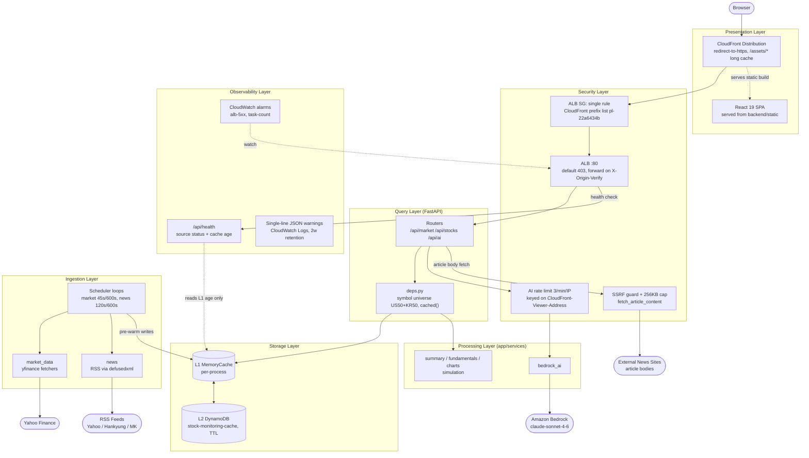
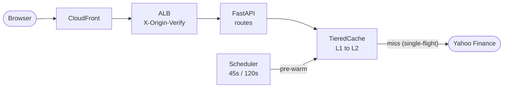

# Architecture

---

# English

## System Overview

**stock-monitoring** is a real-time stock monitoring web service: a single ECS Fargate container serving a FastAPI backend and a pre-built React SPA, fronted by CloudFront and an ALB, backed by a two-tier cache (in-process L1 + DynamoDB L2) over Yahoo Finance data, with AI stock/article analysis via Amazon Bedrock.

- Tech stack: Python 3.12 + FastAPI (backend), React 19 + TypeScript + Vite (frontend), Python CDK v2 (infra), DynamoDB (cache), Amazon Bedrock `global.anthropic.claude-sonnet-4-6` (AI).
- Primary data flow: a background scheduler pre-warms quotes/overview/news into the tiered cache on market-aware intervals; API routes read through the cache and only hit Yahoo Finance / RSS on a miss (single-flight per key).
- Production: https://d2wa9w1vbqlndl.cloudfront.net (`StockMonitoringStack`, ap-northeast-2). No network resources are created — the pre-existing `cc-on-bedrock-vpc` is referenced only.

## Components

### Ingestion Layer
- **backend/app/services/market_data.py** -- yfinance fetchers for quotes (US 50 + KR 50 symbols), indices, economic indicators, and market caps. Synchronous; always called via `asyncio.to_thread`.
- **backend/app/services/news.py** -- RSS feed fetchers (Yahoo Finance, Hankyung, MK) parsed with `defusedxml` (blocks entity-expansion DoS), plus `fetch_article_content` for client-supplied article URLs.
- **backend/app/core/scheduler.py** -- background loops that pre-warm `quotes:us`, `quotes:kr`, `overview` (every 45 s market-open / 600 s closed) and `news:feed` (120 s / 600 s). Market caps refresh at most once per 600 s. A failed cycle keeps the previous cache, marks the source `degraded`, and logs a JSON warning — the loop never dies.

### Storage Layer
- **backend/app/cache/memory.py (L1)** -- per-process in-memory cache. Health checks and the live-price overlay read L1 only, so they never trigger an external call.
- **backend/app/cache/dynamo.py (L2)** -- DynamoDB table `stock-monitoring-cache` (partition key `pk`, TTL attribute `ttl`, on-demand billing). Values are stored as JSON strings; survives container restarts.
- **backend/app/cache/tiered.py** -- L1 → L2 → fetch composition with a per-key single-flight lock: concurrent misses on one key produce exactly one upstream call. Stale L2 values serve as fallback when upstream fails.

### Processing Layer
- **backend/app/services/fundamentals.py** -- stock detail: ratios (P/E, EPS, P/B, beta), 52-week range, market cap, sector, period returns.
- **backend/app/services/charts.py** -- OHLCV candles with MA5/MA20 and golden/dead-cross signals.
- **backend/app/services/summary.py** -- market summary and per-sector aggregation over the cached quote lists.
- **backend/app/services/simulation.py** -- deterministic order-book and investor-flow simulation (no real depth/flow data exists for free); responses always carry `"simulated": true`.
- **backend/app/services/bedrock_ai.py** -- Bedrock converse calls for stock analysis and article summary/translation, with typed errors (`BedrockUnavailableError` / `BedrockCallError`).

### Query Layer
- **backend/app/api/market.py** -- `/api/market/overview|quotes|news`; payload builders are shared with the scheduler so both produce identical shapes.
- **backend/app/api/stocks.py** -- `/api/stocks/{symbol}` detail/chart/news/orderbook/investors, including the live-price overlay (quotes cache overwrites the 12 h detail cache's price fields at request time).
- **backend/app/api/ai.py** -- `/api/ai/stocks/{symbol}` and `/api/ai/articles` with the three-way cost defense (rate limit → result cache → global concurrency cap).
- **backend/app/api/deps.py** -- symbol-universe validation (404 outside US 50 + KR 50, which keeps cache key/lock maps finite), fixed cache keys, and the `cached()` wrapper that maps total failure to 503 and updates per-source status.
- **backend/app/models.py** -- pydantic models and the response `envelope` (`{"asOf", "marketOpen", "data"}`).

### Presentation Layer
- **frontend/** -- React 19 + TypeScript SPA (Vite 8): Dashboard, StockDetail, ArticleAnalysis pages; @tanstack/react-query for data; lightweight-charts for candles; Toss-Invest-style dark theme with Korean color convention (up = red, down = blue), Pretendard font.
- **backend/static/** -- the `vite build --outDir ../backend/static` output, served by FastAPI `StaticFiles` with an SPA fallback (non-API GET 404 → `index.html`).
- **CloudFront distribution** -- viewer entry point: redirect-to-https, API behavior uncached (`CACHING_DISABLED`), `/assets/*` (immutable hashed filenames) long-cached (`CACHING_OPTIMIZED`).

### Observability Layer
- **backend/app/api/health.py** -- `GET /api/health`: always 200 (liveness must not depend on external sources), reporting per-source status (`yahoo`/`rss`/`bedrock`: `ok`/`degraded`/`unknown`) and the age in seconds of every pre-warmed cache key. Used by both the ALB target group and the ECS container health check.
- **Structured warnings** -- every failure path logs a single-line JSON warning (`event` + fields) — no silent failures. Logs go to CloudWatch Logs with 2-week retention.
- **CloudWatch alarms** -- `stock-monitoring-alb-5xx` (ELB-generated 5xx ≥ 10 per 5 min) and `stock-monitoring-task-count` (`LiveTaskCount` < 1; missing data breaching, because no metric means no task).

### Security Layer
- **ALB security group** -- a single ingress rule: the CloudFront origin-facing prefix list (`pl-22a6434b`) on tcp/80. Listener is created with `open=False` so CDK never adds a 0.0.0.0/0 rule.
- **X-Origin-Verify header** -- CloudFront injects a secret custom header; the ALB listener's default action is a fixed 403 and only forwards on header match. Direct ALB calls cannot know the value, and viewers cannot forge it (CloudFront overwrites same-named viewer headers).
- **AI rate limiting** -- 3 requests/min/IP keyed on `CloudFront-Viewer-Address` (generated by CloudFront from the TCP connection — unforgeable, unlike the first `X-Forwarded-For` entry), enforced *before* the cache so even cache hits spend budget; plus a global Bedrock concurrency semaphore (2) and a 6 h result cache.
- **SSRF guards** -- `news.fetch_article_content` takes client URLs: scheme allow-list (http/https), private/loopback/link-local IP rejection, 256 KB streaming cap, and backtracking-bounded regex (`[^<>]{0,1000}`) to prevent O(n²) DoS.
- **Fixed error strings** -- AI error bodies are constants (`ai_unavailable`, `ai_failed`, `article_unavailable`); exception text (which can contain account IDs/ARNs) goes to server logs only.

## Full Architecture Diagram

## Data Flow Summary

Critical path (a dashboard request):

In steady state the scheduler keeps the pre-warmed keys fresh, so a viewer request almost never reaches Yahoo Finance directly — it is answered from L1.

## Infrastructure

### Deployment Region
- **ap-northeast-2** (Seoul) — `StockMonitoringStack`; CloudFront is global.
- VPC `vpc-0dfa5610180dfa628` (`cc-on-bedrock-vpc`) is **referenced only** — subnets/NAT GW/IGW are never created. All names carry the `stock-monitoring` prefix because the VPC is shared.

### Resources (from `infra/stacks/stock_monitoring_stack.py`)

| Resource | Name / ID | Details |
|----------|-----------|---------|
| DynamoDB table | `stock-monitoring-cache` | PK `pk` (S), TTL attribute `ttl`, PAY_PER_REQUEST, `RemovalPolicy.DESTROY` (pure cache) |
| Secrets Manager secret | `stock-monitoring/origin-verify` | 32 chars, no punctuation; unwrapped at synth time (see design decisions) |
| ECS cluster | `stock-monitoring` | In the shared VPC |
| Docker image asset | — | Build context = repo root (multi-stage Dockerfile), platform **linux/arm64** |
| Fargate task definition | family `stock-monitoring` | 0.5 vCPU / 1 GB, ARM64 (Graviton); env `CACHE_TABLE`, `BEDROCK_REGION`; container health check `GET /api/health` every 30 s (re-declared: the ECS agent ignores the image `HEALTHCHECK`) |
| Task role policy | — | DynamoDB `GetItem/PutItem/BatchGetItem/BatchWriteItem/Query` scoped to the table ARN; `bedrock:InvokeModel` on `*` (the `global.` profile resolves to cross-region model ARNs) |
| Fargate service | `stock-monitoring` | **desired_count=1** (load-bearing: L1 cache and AI semaphore are per-process), private subnets, min 100% / max 200% |
| ALB security group | `stock-monitoring-alb-sg` | Single ingress: prefix list `pl-22a6434b` tcp/80 (one prefix-list rule consumes ~55 SG rule slots, hence the dedicated SG) |
| ALB | `stock-monitoring-alb` | Internet-facing, public subnets |
| HTTP listener | :80, `open=False` | Default action: fixed 403; priority-1 rule forwards only on `X-Origin-Verify` match |
| Target group | `stock-monitoring-tg` | Port 8000, health check `/api/health` expecting 200 |
| Origin request policy | `stock-monitoring-all-viewer-and-viewer-address` | All viewer headers **plus** `CloudFront-Viewer-Address`, all query strings, all cookies |
| CloudFront distribution | `d2wa9w1vbqlndl` | Default behavior: `CACHING_DISABLED`, `ALLOW_ALL` methods, compress, redirect-to-https, HTTP-only origin (ALB has no cert); `/assets/*`: `CACHING_OPTIMIZED` |
| CloudWatch alarm | `stock-monitoring-alb-5xx` | ELB-generated 5xx ≥ 10 per 5 min; missing data = not breaching |
| CloudWatch alarm | `stock-monitoring-task-count` | `LiveTaskCount` min < 1 for 2 × 5 min; missing data = **breaching** |
| Log group | `stock-monitoring` stream prefix | awslogs driver, 2-week retention |

### Deployed Resources
- CloudFront: `https://d2wa9w1vbqlndl.cloudfront.net` (stack output `CloudFrontURL`)
- ALB DNS: `stock-monitoring-alb-1937169801.ap-northeast-2.elb.amazonaws.com` (stack output `AlbDNS`; direct access is blocked by design)
- Cache table: `stock-monitoring-cache` (stack output `CacheTableName`)

## Key Design Decisions

- **Yahoo Finance as the data source** -- the KRX Open API key was never approved; yfinance is free and unauthenticated, and one source covers both US and KR symbols.
- **Two-tier cache (L1 memory + L2 DynamoDB TTL) with single-flight key locks** -- L1 gives request-path speed, L2 survives container restarts and absorbs cold starts; the per-key lock means N concurrent misses cost exactly one upstream call (both a latency and a Bedrock-cost defense).
- **Live price overlay** -- the 60 s-class quotes cache overwrites the 12 h detail cache's `price/change/volume` at response time, so the dashboard table, detail header, and order book always show the same price without re-fetching fundamentals.
- **Bedrock model `global.anthropic.claude-sonnet-4-6`** -- ap-northeast-2 has no `us.`-prefixed sonnet-4-6 inference profile (verified 2026-08-02); the `global.` profile is the only valid one in this region.
- **AI rate-limit key = `CloudFront-Viewer-Address`** -- the first `X-Forwarded-For` entry is client-controlled and was demonstrated live (2026-08-02) to allow unlimited limit evasion by rotating values; the viewer-address header is generated by CloudFront from the TCP connection and cannot be forged.
- **Custom origin request policy instead of managed `ALL_VIEWER_EXCEPT_HOST_HEADER`** -- the managed policy's `allExcept` behavior forwards *no* CloudFront-generated header, which would starve the rate limiter; the custom `allViewerAndWhitelistCloudFront` policy whitelists `CloudFront-Viewer-Address`. Cost: the viewer Host header now reaches the origin — harmless, as neither the ALB (header-rule routing only) nor the backend reads Host.
- **ALB reachable only via prefix-list SG + X-Origin-Verify** -- two independent layers: the SG drops non-CloudFront packets, and the listener 403s anything without the secret header, so the origin cannot be bypassed even from CloudFront IP space. `open=False` on the listener is load-bearing (the default would add a 0.0.0.0/0 SG rule).
- **`desired_count=1` and one uvicorn worker** -- the L1 cache and the AI concurrency semaphore are per-process; scaling out would split the cache and multiply the Bedrock concurrency cap. Deliberate trade-off at this traffic level.
- **ARM64 image** -- the build host is aarch64 with no QEMU for amd64 cross-builds; Fargate Graviton is also cheaper.
- **Secret `unsafe_unwrap()` at synth time** -- listener-rule conditions and CloudFront custom headers do not support secret dynamic references; the value lands in the template, and rotation = stack redeploy. Accepted trade-off.
- **`LiveTaskCount` alarm instead of `RunningTaskCount`** -- `RunningTaskCount` exists only with Container Insights (not enabled); `LiveTaskCount` is emitted regardless and reports 0, so missing data can be treated as breaching.
- **SSRF/DoS guards on article fetch** -- the URL is client-supplied: scheme allow-list, private-IP rejection, 256 KB streaming cap, and backtracking-bounded regex block SSRF and O(n²) regex DoS.
- **Rate limit before cache** -- a cache hit still spends the caller's budget, so one IP cannot poll AI endpoints without bound.
- **Simulated order book / investor flows are labeled** -- no free real-time depth or flow data exists; responses carry `"simulated": true` so the UI can disclose it.

## Operations

- Deployment: see [docs/runbooks/deploy-production.md](runbooks/deploy-production.md) — `cd infra && .venv/bin/cdk deploy --require-approval never` (~4 min), then `bash scripts/smoke.sh <CloudFrontURL> <AlbDNS>`.
- Rollback: see [docs/runbooks/rollback-production.md](runbooks/rollback-production.md).
- Incident response: see [docs/runbooks/incident-response.md](runbooks/incident-response.md) — start from `GET /api/health` (source status + cache age) and the two CloudWatch alarms.
- New runbooks follow [docs/runbooks/.template.md](runbooks/.template.md); architecture decisions are recorded in [docs/decisions/](decisions/) using [.template.md](decisions/.template.md).

---

# 한국어

## 시스템 개요

**stock-monitoring**은 실시간 주식 모니터링 웹 서비스다. 단일 ECS Fargate 컨테이너가 FastAPI 백엔드와 빌드된 React SPA를 함께 서빙하고, 그 앞을 CloudFront와 ALB가 감싼다. 데이터는 Yahoo Finance 기반이며 2계층 캐시(프로세스 내 L1 + DynamoDB L2)를 거치고, AI 종목/기사 분석은 Amazon Bedrock으로 수행한다.

- 기술 스택: Python 3.12 + FastAPI(백엔드), React 19 + TypeScript + Vite(프론트엔드), Python CDK v2(인프라), DynamoDB(캐시), Amazon Bedrock `global.anthropic.claude-sonnet-4-6`(AI).
- 기본 데이터 흐름: 백그라운드 스케줄러가 장중/휴장 주기에 맞춰 quotes/overview/news를 계층 캐시에 선제 갱신하고, API 라우트는 캐시를 경유해 읽으며 미스일 때만 Yahoo Finance/RSS를 조회한다(키별 single-flight).
- 프로덕션: https://d2wa9w1vbqlndl.cloudfront.net (`StockMonitoringStack`, ap-northeast-2). 네트워크 리소스는 생성하지 않으며 기존 `cc-on-bedrock-vpc`를 참조만 한다.

## 구성 요소

### Ingestion Layer (수집 계층)
- **backend/app/services/market_data.py** -- yfinance 기반 시세(미국 50 + 한국 50 종목)/지수/경제지표/시가총액 조회. 동기 함수이므로 항상 `asyncio.to_thread`로 호출한다.
- **backend/app/services/news.py** -- RSS 피드(Yahoo Finance, 한국경제, 매일경제)를 `defusedxml`로 파싱(엔티티 확장 DoS 차단)하고, 클라이언트가 준 기사 URL 본문을 `fetch_article_content`로 조회한다.
- **backend/app/core/scheduler.py** -- `quotes:us`/`quotes:kr`/`overview`(장중 45초 / 휴장 600초)와 `news:feed`(120초 / 600초)를 선제 갱신하는 백그라운드 루프. 시가총액은 600초에 한 번만 갱신한다. 사이클 실패 시 기존 캐시를 유지하고 소스를 `degraded`로 표시하며 JSON 경고를 남긴다 — 루프는 절대 죽지 않는다.

### Storage Layer (저장 계층)
- **backend/app/cache/memory.py (L1)** -- 프로세스 내 인메모리 캐시. 헬스체크와 가격 오버레이는 L1만 읽으므로 외부 호출을 유발하지 않는다.
- **backend/app/cache/dynamo.py (L2)** -- DynamoDB 테이블 `stock-monitoring-cache`(파티션 키 `pk`, TTL 속성 `ttl`, 온디맨드 과금). 값은 JSON 문자열로 저장되며 컨테이너 재시작을 견딘다.
- **backend/app/cache/tiered.py** -- L1 → L2 → fetch 조합 + 키별 single-flight 락: 같은 키의 동시 미스는 업스트림 호출을 정확히 한 번만 발생시킨다. 업스트림 실패 시 stale L2 값으로 폴백한다.

### Processing Layer (가공 계층)
- **backend/app/services/fundamentals.py** -- 종목 상세: 지표(PER, EPS, PBR, 베타), 52주 범위, 시가총액, 섹터, 기간수익률.
- **backend/app/services/charts.py** -- OHLCV 캔들 + MA5/MA20 + 골든/데드 크로스 신호.
- **backend/app/services/summary.py** -- 캐시된 시세 목록에서 시장 요약과 섹터별 집계를 만든다.
- **backend/app/services/simulation.py** -- 결정적 호가/수급 시뮬레이션(무료 실데이터가 없음). 응답에는 항상 `"simulated": true`가 담긴다.
- **backend/app/services/bedrock_ai.py** -- 종목 분석·기사 요약/번역용 Bedrock converse 호출. 타입 있는 예외(`BedrockUnavailableError` / `BedrockCallError`)를 낸다.

### Query Layer (조회 계층)
- **backend/app/api/market.py** -- `/api/market/overview|quotes|news`. 페이로드 빌더를 스케줄러와 공유하므로 두 경로의 응답 형태가 항상 같다.
- **backend/app/api/stocks.py** -- `/api/stocks/{symbol}` 상세/차트/뉴스/호가/수급 + 가격 오버레이(요청 시점에 quotes 캐시가 12시간 detail 캐시의 가격 필드를 덮어쓴다).
- **backend/app/api/ai.py** -- `/api/ai/stocks/{symbol}`, `/api/ai/articles`. 3중 비용 방어(레이트리밋 → 결과 캐시 → 전역 동시 실행 제한).
- **backend/app/api/deps.py** -- 심볼 유니버스 검증(미국 50 + 한국 50 밖은 404 — 캐시 키/락 맵을 유한하게 유지), 고정 캐시 키, 전체 실패를 503으로 매핑하고 소스 상태를 갱신하는 `cached()` 래퍼.
- **backend/app/models.py** -- pydantic 모델과 응답 `envelope`(`{"asOf", "marketOpen", "data"}`).

### Presentation Layer (표현 계층)
- **frontend/** -- React 19 + TypeScript SPA(Vite 8): Dashboard, StockDetail, ArticleAnalysis 페이지. 데이터는 @tanstack/react-query, 캔들은 lightweight-charts. Toss Invest 참조 다크 테마, 한국 관례 색상(상승=빨강/하락=파랑), Pretendard 폰트.
- **backend/static/** -- `vite build --outDir ../backend/static` 산출물. FastAPI `StaticFiles`가 서빙하며 SPA fallback(비-API GET 404 → `index.html`)을 갖는다.
- **CloudFront 배포** -- 뷰어 진입점: redirect-to-https, API는 미캐시(`CACHING_DISABLED`), `/assets/*`(불변 해시 파일명)는 장기 캐시(`CACHING_OPTIMIZED`).

### Observability Layer (관측 계층)
- **backend/app/api/health.py** -- `GET /api/health`: 항상 200(생존 판정이 외부 소스에 좌우되면 안 된다). 소스별 상태(`yahoo`/`rss`/`bedrock`: `ok`/`degraded`/`unknown`)와 선제 갱신 캐시 키들의 age(초)를 보고한다. ALB 타깃 그룹과 ECS 컨테이너 헬스체크가 함께 사용한다.
- **구조화 경고** -- 모든 실패 경로는 단일 라인 JSON 경고(`event` + 필드)를 남긴다 — 조용한 실패 금지. 로그는 CloudWatch Logs에 2주 보존된다.
- **CloudWatch 알람** -- `stock-monitoring-alb-5xx`(ELB 자체 생성 5xx가 5분에 10건 이상), `stock-monitoring-task-count`(`LiveTaskCount` < 1, 결측 = breaching — 지표가 없다는 것은 태스크가 없다는 뜻).

### Security Layer (보안 계층)
- **ALB 보안 그룹** -- 인바운드 규칙은 CloudFront origin-facing prefix list(`pl-22a6434b`) tcp/80 단 하나. 리스너를 `open=False`로 만들어 CDK가 0.0.0.0/0 규칙을 추가하지 못하게 한다.
- **X-Origin-Verify 헤더** -- CloudFront가 시크릿 커스텀 헤더를 주입하고, ALB 리스너의 기본 동작은 고정 403이며 헤더가 일치할 때만 forward한다. ALB를 직접 때리는 요청은 값을 알 수 없고, 뷰어가 같은 이름을 보내도 CloudFront가 덮어쓰므로 위조가 불가능하다.
- **AI 레이트리밋** -- `CloudFront-Viewer-Address`(CloudFront가 TCP 연결에서 직접 생성 — `X-Forwarded-For` 첫 항목과 달리 위조 불가) 기준 IP당 분당 3회. 캐시보다 **앞에서** 집행하므로 캐시 히트도 예산을 소비한다. 여기에 전역 Bedrock 동시 실행 세마포어(2)와 6시간 결과 캐시가 더해진다.
- **SSRF 가드** -- `news.fetch_article_content`는 클라이언트 URL을 받는다: 스킴 허용 목록(http/https), private/loopback/link-local IP 거부, 256KB 스트리밍 캡, 백트래킹 상한 regex(`[^<>]{0,1000}`)로 SSRF와 O(n²) DoS를 차단한다.
- **고정 오류 문구** -- AI 오류 본문은 상수(`ai_unavailable`, `ai_failed`, `article_unavailable`)다. 계정 ID/ARN이 섞일 수 있는 예외 문자열은 서버 로그에만 남긴다.

## 전체 아키텍처 다이어그램

## 데이터 흐름 요약

핵심 경로(대시보드 요청):

정상 상태에서는 스케줄러가 선제 갱신 키를 항상 신선하게 유지하므로, 뷰어 요청이 Yahoo Finance까지 직접 가는 일은 거의 없다 — 대부분 L1에서 응답된다.

## 인프라

### 배포 리전
- **ap-northeast-2** (서울) — `StockMonitoringStack`. CloudFront는 글로벌.
- VPC `vpc-0dfa5610180dfa628`(`cc-on-bedrock-vpc`)은 **참조만** 한다 — 서브넷/NAT GW/IGW를 생성하지 않는다. 공유 VPC이므로 모든 이름에 `stock-monitoring` 프리픽스를 붙인다.

### 리소스 (`infra/stacks/stock_monitoring_stack.py` 기준)

| 리소스 | 이름 / ID | 상세 |
|--------|-----------|------|
| DynamoDB 테이블 | `stock-monitoring-cache` | PK `pk`(S), TTL 속성 `ttl`, PAY_PER_REQUEST, `RemovalPolicy.DESTROY`(순수 캐시) |
| Secrets Manager 시크릿 | `stock-monitoring/origin-verify` | 32자, 특수문자 제외; synth 시점에 unwrap (설계 결정 참조) |
| ECS 클러스터 | `stock-monitoring` | 공유 VPC 내 |
| Docker 이미지 에셋 | — | 빌드 컨텍스트 = 리포지토리 루트(멀티스테이지 Dockerfile), 플랫폼 **linux/arm64** |
| Fargate 태스크 정의 | family `stock-monitoring` | 0.5 vCPU / 1GB, ARM64(Graviton); env `CACHE_TABLE`, `BEDROCK_REGION`; 컨테이너 헬스체크 `GET /api/health` 30초 간격(ECS 에이전트가 이미지 `HEALTHCHECK`를 무시하므로 재선언) |
| 태스크 롤 정책 | — | DynamoDB `GetItem/PutItem/BatchGetItem/BatchWriteItem/Query` 테이블 ARN 한정; `bedrock:InvokeModel`은 `*`(`global.` 프로파일이 교차 리전 모델 ARN으로 해석되므로) |
| Fargate 서비스 | `stock-monitoring` | **desired_count=1**(load-bearing: L1 캐시와 AI 세마포어가 프로세스 단위), private 서브넷, min 100% / max 200% |
| ALB 보안 그룹 | `stock-monitoring-alb-sg` | 인바운드 단일 규칙: prefix list `pl-22a6434b` tcp/80 (prefix list 규칙 하나가 SG 슬롯 ~55개를 소비하므로 전용 SG) |
| ALB | `stock-monitoring-alb` | internet-facing, public 서브넷 |
| HTTP 리스너 | :80, `open=False` | 기본 동작 고정 403; priority-1 규칙이 `X-Origin-Verify` 일치 시에만 forward |
| 타깃 그룹 | `stock-monitoring-tg` | 포트 8000, 헬스체크 `/api/health` 200 기대 |
| Origin request policy | `stock-monitoring-all-viewer-and-viewer-address` | 모든 뷰어 헤더 **+** `CloudFront-Viewer-Address`, 모든 쿼리스트링, 모든 쿠키 |
| CloudFront 배포 | `d2wa9w1vbqlndl` | 기본 동작: `CACHING_DISABLED`, `ALLOW_ALL` 메서드, 압축, redirect-to-https, HTTP-only 오리진(ALB에 인증서 없음); `/assets/*`: `CACHING_OPTIMIZED` |
| CloudWatch 알람 | `stock-monitoring-alb-5xx` | ELB 자체 생성 5xx가 5분에 10건 이상; 결측 = not breaching |
| CloudWatch 알람 | `stock-monitoring-task-count` | `LiveTaskCount` 최솟값 < 1이 2×5분 지속; 결측 = **breaching** |
| 로그 그룹 | 스트림 프리픽스 `stock-monitoring` | awslogs 드라이버, 2주 보존 |

### 배포된 리소스
- CloudFront: `https://d2wa9w1vbqlndl.cloudfront.net` (스택 출력 `CloudFrontURL`)
- ALB DNS: `stock-monitoring-alb-1937169801.ap-northeast-2.elb.amazonaws.com` (스택 출력 `AlbDNS`; 직접 접근은 설계상 차단됨)
- 캐시 테이블: `stock-monitoring-cache` (스택 출력 `CacheTableName`)

## 핵심 설계 결정

- **데이터 소스 Yahoo Finance** -- KRX Open API 키가 미승인 상태였다. yfinance는 무료·무인증이며 미국/한국 심볼을 한 소스로 커버한다.
- **2계층 캐시(L1 메모리 + L2 DynamoDB TTL) + single-flight 키 락** -- L1은 요청 경로 속도를, L2는 컨테이너 재시작 생존과 콜드 스타트 흡수를 담당한다. 키별 락 덕에 동시 미스 N건이 업스트림 호출 1건으로 수렴한다(지연·Bedrock 비용 방어).
- **가격 오버레이** -- 60초급 quotes 캐시가 응답 시점에 12시간 detail 캐시의 `price/change/volume`을 덮어쓴다. 대시보드 테이블, 상세 헤더, 호가가 항상 같은 가격을 보여주면서 펀더멘털 재조회는 하지 않는다.
- **Bedrock 모델 `global.anthropic.claude-sonnet-4-6`** -- ap-northeast-2에는 `us.` 프리픽스 sonnet-4-6 추론 프로파일이 없다(2026-08-02 실측). 이 리전에서 유효한 것은 `global.` 프로파일뿐이다.
- **AI 레이트리밋 키 = `CloudFront-Viewer-Address`** -- `X-Forwarded-For` 첫 항목은 클라이언트가 임의로 채울 수 있어 값을 바꿔가며 한도를 무한히 우회할 수 있음이 라이브로 실증됐다(2026-08-02). 뷰어 주소 헤더는 CloudFront가 TCP 연결에서 직접 생성하므로 위조가 불가능하다.
- **관리형 `ALL_VIEWER_EXCEPT_HOST_HEADER` 대신 커스텀 origin request policy** -- 관리형 정책은 `allExcept` 동작이라 CloudFront가 생성한 헤더를 하나도 전달하지 못해 레이트리밋 키가 사라진다. 커스텀 `allViewerAndWhitelistCloudFront` 정책이 `CloudFront-Viewer-Address`를 화이트리스트한다. 대가는 뷰어 Host 헤더가 오리진에 전달되는 것인데, ALB(헤더 규칙 라우팅만 사용)도 백엔드도 Host를 읽지 않으므로 무해하다.
- **ALB 접근은 prefix-list SG + X-Origin-Verify로만** -- 독립된 2중 방어: SG가 CloudFront 외 패킷을 버리고, 리스너가 시크릿 헤더 없는 요청을 403 처리하므로 CloudFront IP 대역에서도 오리진을 우회할 수 없다. 리스너의 `open=False`가 load-bearing이다(기본값이면 0.0.0.0/0 SG 규칙이 추가된다).
- **`desired_count=1` + uvicorn 워커 1개** -- L1 캐시와 AI 동시 실행 세마포어가 프로세스 단위다. 스케일아웃하면 캐시가 갈라지고 Bedrock 동시 실행 상한이 배수로 늘어난다. 현재 트래픽 수준에서 의도된 트레이드오프다.
- **ARM64 이미지** -- 빌드 호스트가 aarch64이고 amd64 크로스빌드용 QEMU가 없다. Fargate Graviton이 더 저렴하기도 하다.
- **시크릿 `unsafe_unwrap()` (synth 시점)** -- 리스너 규칙 조건과 CloudFront 커스텀 헤더는 시크릿 동적 참조를 지원하지 않는다. 값이 템플릿에 들어가며, 로테이션 = 스택 재배포. 수용한 트레이드오프다.
- **`RunningTaskCount` 대신 `LiveTaskCount` 알람** -- `RunningTaskCount`는 Container Insights(미활성) 전용 지표라 영구 INSUFFICIENT_DATA에 빠진다. `LiveTaskCount`는 Insights 없이도 0까지 보고하므로 결측을 breaching으로 처리할 수 있다.
- **기사 조회 SSRF/DoS 가드** -- URL이 클라이언트에서 온다: 스킴 허용 목록, private IP 거부, 256KB 스트리밍 캡, 백트래킹 상한 regex로 SSRF와 O(n²) regex DoS를 차단한다.
- **레이트리밋이 캐시보다 앞** -- 캐시 히트도 예산을 소비하므로 한 IP가 AI 엔드포인트를 무한히 폴링할 수 없다.
- **시뮬레이션 호가/수급 명시** -- 무료 실시간 호가·수급 데이터가 없다. 응답에 `"simulated": true`를 담아 UI가 이를 고지할 수 있게 한다.

## 운영

- 배포: [docs/runbooks/deploy-production.md](runbooks/deploy-production.md) 참조 — `cd infra && .venv/bin/cdk deploy --require-approval never` (~4분) 후 `bash scripts/smoke.sh <CloudFrontURL> <AlbDNS>`.
- 롤백: [docs/runbooks/rollback-production.md](runbooks/rollback-production.md) 참조.
- 장애 대응: [docs/runbooks/incident-response.md](runbooks/incident-response.md) 참조 — `GET /api/health`(소스 상태 + 캐시 age)와 CloudWatch 알람 2종에서 시작한다.
- 새 런북은 [docs/runbooks/.template.md](runbooks/.template.md)를, 아키텍처 결정 기록은 [docs/decisions/](decisions/)의 [.template.md](decisions/.template.md)를 따른다.
